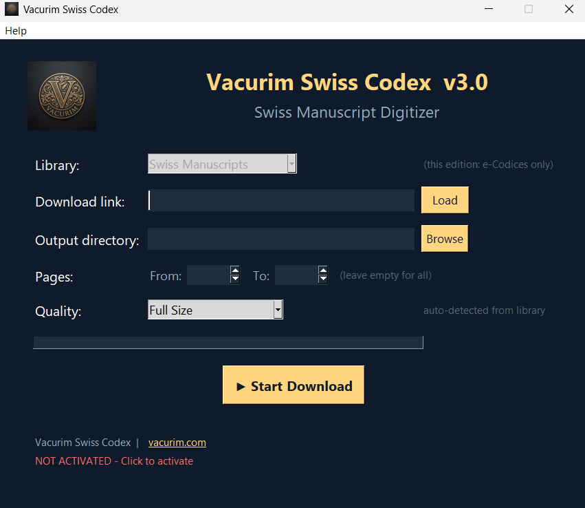
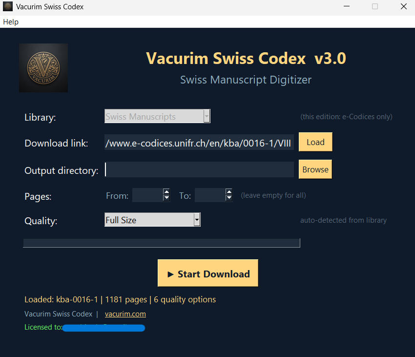
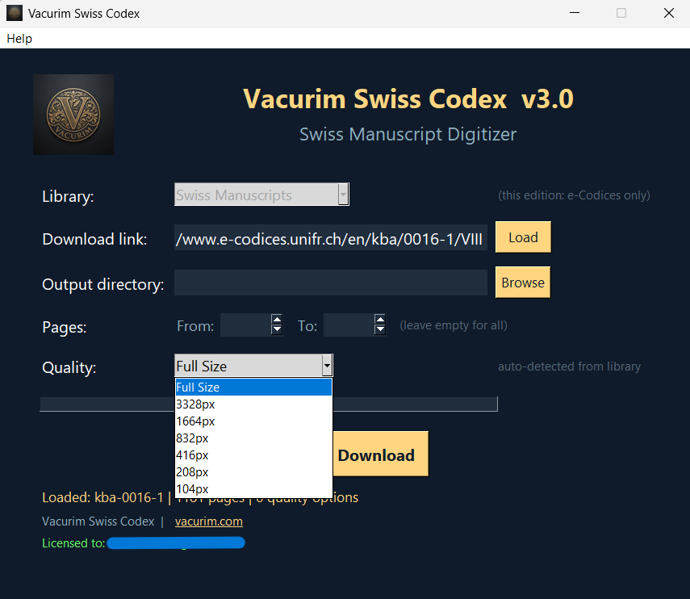

<p align="center">
  
</p>

<h1 align="center">Vacurim</h1>

<p align="center">
  <strong>Digital Infrastructure Solutions</strong><br>
  Tools for manuscript digitization, currency exchange, and digital security.
</p>

<p align="center">
  <a href="https://vacurim.com/">Website</a> ·
  <a href="https://vacurim.com/vacurim-codex/manuscript-digitizer/">Products</a> ·
  <a href="https://vacurim.com/vacurim-codex/">Tools</a> ·
  <a href="https://vacurim.com/vacurim-codex/manuscript-digitizer/">Pricing</a> ·
  <a href="https://vacurim.com/contact/">Contact</a>
</p>

---

## About Vacurim

**Vacurim** is a software studio building **Digital Infrastructure Solutions** across three product lines:

| Line | Focus | Audience |
|------|-------|----------|
| **Codex** | Tools for digitizing, organizing, and working with primary-source documents, manuscripts, and digital archives. | Scholars, archivists, digital humanists. |
| **TradeLink** | Software for commerce, trade, and supply-chain workflows. | Merchants, logistics managers, B2B teams. |
| **Security** | Digital security utilities for researchers, professionals, and organizations. | Security researchers, IT managers. |

Each product line ships for **Windows**, with lifetime, annual, and short-term pass licensing options.

---

## Special Welcome Offer for GitHub Users

We are running a **welcome promotion** exclusively for the GitHub community.

- **Promo code:** `GITHUBWELCOME2026`
- **Discount:** 20% off any premium product in the Codex line
- **How to use:** Click the link below — the code is applied automatically at checkout.

<p align="center">
  <a href="https://vacurim.com/promo-landing/?utm_source=github&utm_medium=listing&utm_campaign=github_welcome_2026&code=GITHUBWELCOME2026&ref=github">
    <strong>👉 Claim your 20% GitHub welcome discount</strong>
  </a>
</p>

> Limited to the first 50 redemptions. Applies to Swiss Codex Pro, Vatican Codex Pro, and Suite Pro.

---

## Free Online Tools

These tools run in the browser, free of charge, no installation required.

### Currency Calculator (Toman)
A bilingual (FA/EN) buy/sell calculator for Iranian exchange offices. Features dark mode, real-time calculation, and copy-to-clipboard.

**Use online:** [vacurim.com/tools/currency-calculator/](https://vacurim.com/tools/currency-calculator/)

### Free Manuscript Digitizer
A free online digitizer for manuscript researchers — download from eCodices, Vatican Library, and more.

**Use online:** [vacurim.com/tools/free-digitizer/](https://vacurim.com/tools/free-digitizer/)

---

## Premium Products — Codex Line

Professional desktop applications with full feature sets, lifetime licensing, and priority support. Available for **Windows**.

### Vacurim Swiss Codex Pro
Download and digitize manuscripts from the e-Codices library (Swiss manuscripts). Convert to UltraHD PDF with quality selection.

<p float="left">
  
  
  
</p>

### Vacurim Vatican Codex Pro
Download and digitize manuscripts from the Vatican Library (DigiVatLib). Convert to UltraHD PDF with quality selection.

### Vacurim Suite Pro
All-in-one bundle — Swiss Codex + Vatican Codex + future Codex products in a single license.

**Browse all products & pricing:** [vacurim.com/vacurim-codex/manuscript-digitizer/](https://vacurim.com/vacurim-codex/manuscript-digitizer/)

---

## Getting Started

### Use the Free Tools
1. Visit the [Codex Tools page](https://vacurim.com/vacurim-codex/).
2. Pick the tool you need — currency calculator or free manuscript digitizer.
3. Use it directly in your browser. No installation, no signup.

### Buy a Premium Product
1. Browse the [Manuscript Digitizer product page](https://vacurim.com/vacurim-codex/manuscript-digitizer/).
2. Choose the product that fits your workflow (Swiss Codex, Vatican Codex, or Suite).
3. **Apply the welcome promo `GITHUBWELCOME2026` at checkout for 20% off** — or use the [auto-applied promo link](https://vacurim.com/promo-landing/?utm_source=github&utm_medium=listing&utm_campaign=github_welcome_2026&code=GITHUBWELCOME2026&ref=github).
4. Complete checkout. You will receive a download link and license key by email.

### System Requirements
- Windows 10/11.
- Active internet connection for download and activation.
- For manuscript tools: stable connection to source library (e-Codices / DigiVatLib).

---

## Repository Structure

```
vacurim-codex/
├── README.md                  This file
├── LICENSE                    MIT License (code) + brand reservation
├── CONTRIBUTING.md            How to contribute
├── CODE_OF_CONDUCT.md         Community standards
├── index.html                 GitHub Pages landing page
├── docs/                      Images and documentation assets
│   ├── cover-banner.png
│   └── swiss-codex-{1,2,3}.png
├── tools/                     Source for free online tools
│   └── currency-calculator/
│       └── index.html
└── .github/
    ├── ISSUE_TEMPLATE/        Bug report + feature request templates
    └── PULL_REQUEST_TEMPLATE.md
```

---

## Contributing

We welcome bug reports, feature requests, and pull requests — see [CONTRIBUTING.md](CONTRIBUTING.md).

This project follows the [Contributor Covenant](CODE_OF_CONDUCT.md). By participating, you agree to uphold its code of conduct.

---

## License

The source code in this repository is released under the [MIT License](LICENSE).

The **Vacurim brand name, logo, product names, and product binaries** are **not** covered by the MIT License and may not be used without explicit written permission from Vacurim. See the LICENSE file for details.

---

## Links

- **Website:** [vacurim.com](https://vacurim.com/)
- **Codex Tools:** [vacurim.com/vacurim-codex/](https://vacurim.com/vacurim-codex/)
- **Manuscript Digitizer (Products & Pricing):** [vacurim.com/vacurim-codex/manuscript-digitizer/](https://vacurim.com/vacurim-codex/manuscript-digitizer/)
- **Free Currency Calculator:** [vacurim.com/tools/currency-calculator/](https://vacurim.com/tools/currency-calculator/)
- **Free Manuscript Digitizer:** [vacurim.com/tools/free-digitizer/](https://vacurim.com/tools/free-digitizer/)
- **Contact:** [vacurim.com/contact/](https://vacurim.com/contact/)
- **SourceForge:** [sourceforge.net/projects/vacurim-codex/](https://sourceforge.net/projects/vacurim-codex/)
- **GitHub Welcome Promo (20% off):** [Claim link](https://vacurim.com/promo-landing/?utm_source=github&utm_medium=listing&utm_campaign=github_welcome_2026&code=GITHUBWELCOME2026&ref=github)

---

<p align="center">
  <em>Vacurim · Digital Infrastructure Solutions</em><br>
  <em>Preserving the Past, Digitizing the Future.</em>
</p>
